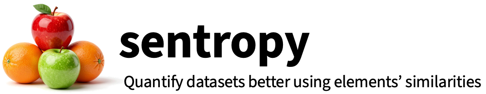

# <h1> <i>sentropy</i>: A Python package for measuring the composition of complex datasets</h1>

[](https://www.python.org/downloads/release/python-380/)
[](https://github.com/ArnaoutLab/sentropy/actions/workflows/tests.yml)

- [About](#about)
  - [Definitions](#definitions)
  - [Partitioned diversity](#partitioned-diversity)
  - [Frequency-sensitive diversity](#frequency-sensitive-diversity)
  - [Similarity-sensitive diversity](#similarity-sensitive-diversity)
  - [Rescaled diversity indices](#rescaled-diversity-indices)
  - [One package to rule them all](#one-package-to-rule-them-all)
- [Basic usage](#basic-usage)
  - [alpha diversities](#alpha-diversities)
  - [beta diversities](#beta-diversities)
- [Advanced usage](#advanced-usage)
  - [Parallelization using the ray package](#parallelization-using-the-ray-package)
  - [Calculating ordinariness](#calculating-ordinariness)
  - [Computing relative entropies](#computing-relative-entropies)
  - [PyTorch and GPU support](#pytorch-and-gpu-support)
- [Command-line usage](#command-line-usage)
- [Applications](#applications)
- [Alternatives](#alternatives)

# About

`sentropy` calculates similarity-sensitive entropies (S-entropy), plus traditional Shannon entropy and the Rényi entropies as special cases.

- **Shannon entropy** is a weighted sum of the relative probabilities of unique elements in a system (e.g. a dataset).
- **Rényi entropies** generalize Shannon entropy by allowing for different weightings (viewpoint parameter *q*).
- **S-entropy** generalizes Rényi entropies by incorporating elements' similarities and differences.
- Exponentiating entropy yields **D-number forms**, which put entropies in the same, natural units—**effective numbers**—among other advantages.
- `sentropy` calculates multiple S-entropic **measures**, including $\alpha, \beta/\rho, \gamma$ at both the subset (classes) **level** and for the overall (data)set

For more background, see [Leinster 2020](https://arxiv.org/abs/2012.02113) and references therein.

[Installation](#installation) | [Basic usage](#basic-usage) | 

# Installation

```
pip install sentropy
```

# Basic usage

Calling `sentropy()` returns an object with relevant values.

## Shannon-type (i.e. *q*=1) S-entropy

$q=1$ means "Shannon-type" because Shannon entropy is the special case of Rényi entropy when $\alpha=q=1$.
```
from sentropy import sentropy
import numpy as np
P = np.array([0.7, 0.3])                      # two unique elements, 70% and 30%, respectively
S = np.array([                                # similarity matrix
  [1. , 0.2],                                 # 20% similar to each other
  [0.2, 1. ],
  ])
DZ = sentropy(P, similarity=S)                # S-entropy with default q (q=1; Shannon-type S-entropy)
D1Z = DZ(level="set", measure="alpha", q=1.)  # D-number form (preferred)
H1Z = np.log(D1Z)                             # traditional form
print(f"D1Z: {D1Z:.1f}")
print(f"H1Z: {H1Z:.1f}")
```
Alternatively (slightly tighter):
```
from sentropy import sentropy
import numpy as np
P = np.array([0.7, 0.3])                      # two unique elements, 70% and 30%, respectively
S = np.array([                                # similarity matrix
  [1. , 0.2],                                 # 20% similar to each other
  [0.2, 1. ],
  ])
D1Z = sentropy(P, similarity=S)    # D-number form (preferred). Note defaults: level="set", measure="alpha", q=1.
H1Z = np.log(D1Z)                  # traditional form
print(f"D1Z: {D1Z:.1f}")
print(f"H1Z: {H1Z:.1f}")
```

## Vanilla Shannon entropy

Traditional Shannon entropy is the limiting case of S-entropy when there is no similarity between elements $i\neq j$ ($S=I$) at $q=1$.
```
from sentropy import sentropy
import numpy as np
P = np.array([0.7, 0.3])      # two unique elements, 70% and 30%, respectively
D1 = sentropy(P)              # S-entropy *without* similarity at default q (q=1) = Shannon entropy. Note defaults: level="set", measure="alpha", q=1.
H1 = np.log(D1)               # traditional form
print(f"D1: {D1:.1f}")
print(f"H1: {H1:.1f}")
```

## S-entropy with multiple measures and viewpoint parameters, at both levels

D-number forms measure diversity. `sentropy` calculates alpha-, beta-, and gamma-diversity measures, at any $q$, for both subsets/classes and the whole (data)set.
```
from sentropy import sentropy
import numpy as np
P = np.array([0.7, 0.3])                      # two unique elements, 70% and 30%, respectively
S = np.array([                                # similarity matrix
  [1. , 0.2],                                 # 20% similar to each other
  [0.2, 1. ],
  ])
qs = [0., 1., 2., np.inf]                     # multiple viewpoint parameters
ms = ["alpha", "beta", "gamma"]               # multiple measures
ls = ["set", "subset"]                        # subset = class
DZ = sentropy(P, similarity=S, q=qs,          # S-entropy with several q...
              measures=ms, level=ls)          # ...of several measures, at both levels
for q in qs:
  for m in ms:
    DqZ = DZ(level="set", measure=m, q=q)     # D-number form (preferred)
    HqZ = np.log(DqZ)                         # traditional form
    print(f"D{q}Z {m}: {DqZ:.1f}")
    print(f"H{q}Z {m}: {HqZ:.1f}")
```

## Similarity on the fly

For when the similarity matrix would be too large for memory.
```
from sentropy import sentropy
import numpy as np
from polyleven import levenshtein

P = np.array([10, 1])
elements = np.array(['good', 'food'])                      # Phuc: if passed a list, sentropy should coerce to a numpy array
def similarity_function(i, j):                             # i, j members of elements
    return 0.3**levenshtein(i, j)
sentropy(P, similarity=similarity_function, X=elements)    # X contains arguments needed by the similarity_function
```

## How well each class represents the whole dataset

Representativeness ($\rho$) is the reciprocal of beta diversity, which measures distinctiveness. 
```
from sentropy import sentropy
import numpy as np
P  = np.array([1, 1, 1, 1])                   # dataset with four equally-frequent elements
C1 = np.array([1, 1, 0, 0])                   # first two elements are in Class 1 (only)
C2 = np.array([0, 0, 1, 1])                   # second two elements are in Class 2 (only)
C  = {"1": C1, "2": C2}                       # names and index membership of classes
S = np.array([                                # similarities of all elements, across both classes
  [1.,  0.8, 0.2, 0.1],
  [0.8, 1.,  0.1, 0.3],
  [0.2, 0.1, 1.,  0.9],
  [0.1, 0.3, 0.9, 1. ],
  ])
R1, R2 = sentropy(P, similarity=S, classes=C,           # note, one value for each class
              level="subset", index="normalized_rho")
print("Normalized representativeness of class 1: {R1:.2f}")
print("Normalized representativeness of class 2: {R2:.2f}")
```

## $q=1$ relative S-entropies between two classes as a pandas DataFrame

The similarity-sensitive version of traditional relative entropy at q=1 (a.k.a. Kullback-Leibler divergence, information divergence, etc.).
```
from sentropy import sentropy
import numpy as np
P  = np.array([1, 1, 1, 1])                   # dataset with four equally-frequent elements
C1 = np.array([1, 1, 0, 0])                   # first two elements are in Class 1 (only)
C2 = np.array([0, 0, 1, 1])                   # second two elements are in Class 2 (only)
C  = {"1": C1, "2": C2}                       # name and package up the classes
S = np.array([                                # similarities of all elements, across both classes
  [1.,  0.8, 0.2, 0.1],
  [0.8, 1.,  0.1, 0.3],
  [0.2, 0.1, 1.,  0.9],
  [0.1, 0.3, 0.9, 1. ],
  ])
df = sentropy(C1, C2, similarity=S,
              return_dataframe=True)
print(df)                                     # S-entropies on the diagonals; relative S-entropies on the off-diagonals
```

### Ordinariness

How much one (set of) element(s) look(s) like (an)other(s).
```

```


## Availability and installation
`sentropy` is available on GitHub at https://github.com/ArnaoutLab/sentropy. It can be installed by running

`pip install sentropy`

from the command-line interface. The test suite runs successfully on Macintosh, Windows, and Unix systems. The unit tests (including a coverage report) can be run after installation by

```
pip install 'sentropy[tests]'
pytest --pyargs sentropy --cov sentropy
```

## How to cite this work

If you use this package, please cite it as:

Nguyen et al., <i>sentropy: A Python Package for Measuring The Composition of Complex Datasets</i>. <https://github.com/ArnaoutLab/diversity>

## Definitions

A ***community*** is a collection of elements called ***individuals***, each of which is assigned a label called its ***species***, where multiple individuals may have the same species. An example of a community is all the animals and plants living in a lake. A ***metacommunity*** consists of several communities. An example of a metacommunity is all the animals in a lake split into different depths. Each community that makes up a metacommunity is called a ***subcommunity***.

More broadly, if one is interested in analyzing a subset of a dataset, then the subset can be viewed as a subcommunity and the entire dataset as the metacommunity. Alternatively, if one is interested in how individual datasets (e.g. from individual research subjects) compare to all datasets used in a study, the individual datasets are subcommunities and the set of all datasets is the metacommunity. We will adopt the terminology ***set*** (or sometimes ***superset***) and ***subset*** for the sake of generality. (When there is only a single dataset under study, we use “subset” and “set” interchangeably as convenient.)

A ***diversity index*** is a statistic associated with a community, which describes how much the species of its individuals vary. For example, a community of many individuals of the same species has a very low diversity whereas a community with multiple species and the same amount of individuals per species has a high diversity.

## Partitioned diversity

Some diversity indices compare the diversities of the subsets with respect to the overall set. For example, two subsets with the same frequency distribution but no shared species each comprise half of the combined set diversity.

## Frequency-sensitive diversity

[In 1973, Hill introduced a framework](https://doi.org/10.2307/1934352) which unifies commonly used diversity indices into a single parameterized family of diversity measures. The so-called ***viewpoint parameter*** can be thought of as the sensitivity to rare species. At one end of the spectrum, when the viewpoint parameter is set to 0, species frequency is ignored entirely, and only the number of distinct species matters, while at the other end of the spectrum, when the viewpoint parameter is set to $\infty$, only the highest frequency species in a community is considered by the corresponding diversity measure. Common diversity measures such as ***species richness***, ***Shannon entropy***, the ***Gini-Simpson index***, and the ***Berger-Parker index*** have simple and natural relationships with Hill's indices at different values for the viewpoint parameter ($0$, $1$, $2$, $\infty$, respectively).

## Similarity-sensitive diversity

In addition to being sensitive to frequency, it often makes sense to account for similarity in a diversity measure. For example, a community of two different types of rodents may be considered less diverse than a community where one of the rodent species was replaced by the same number of individuals of a bird species. [Leinster and Cobbold](https://doi.org/10.1890/10-2402.1) and [Reeve et al.](https://arxiv.org/abs/1404.6520) present a general mathematically rigorous way of incorporating similarity measures into Hill's framework, resulting in what we refer to as the LCR framework or simply LCR. LCR describes a family of similarity-sensitive diversity indices parameterized by the same viewpoint parameter as well as the similarity function used for the species in the meta- or subcommunities of interest. These similarity-sensitive diversity measures account for both the pairwise similarity between all species and their frequencies.

## Rescaled diversity indices

In addition to the diversity measures introduced by [Reeve et al.](https://arxiv.org/abs/1404.6520), we also included two new rescaled measures $\hat{\rho}$ and $\hat{\beta}$, as well as their superset counterparts. The motivation for introducing these measures is that $\rho$ can become very large if the number of subcommunities is large. Similarly, $\beta$ can become very small in this case. The rescaled versions are designed so that they remain of order unity even when there are lots of subcommunities.

## One package to rule them all

The `sentropy` package is able to calculate all of the similarity- and frequency-sensitive subset and set diversity measures described in [Reeve et al.](https://arxiv.org/abs/1404.6520). See the paper for more in-depth information on their derivation and interpretation.


**Supported subcommunity diversity measures**:

  - $\alpha$ - diversity of subset $j$ in isolation, per individual
  - $\bar{\alpha}$ - diversity of subset $j$ in isolation
  - $\rho$ - redundancy of subset $j$
  - $\bar{\rho}$ - representativeness of subset $j$
  - $\hat{\rho}$ - rescaled version of redundancy ($\rho$)
  - $\beta$ - distinctiveness of subset $j$
  - $\bar{\beta}$ - effective number of distinct subsets
  - $\hat{\beta}$ - rescaled version of distinctiveness ($\beta$) 
  - $\gamma$ - contribution of subset $j$ toward set diversity


**Supported set diversity measures**:
  - $A$ - naive-community set diversity
  - $\bar{A}$ - average diversity of subsets
  - $R$ - average redundancy of subsets
  - $\bar{R}$ - average representativeness of subsets
  - $\hat{R}$ - average rescaled redundancy of subsets
  - $B$ - average distinctiveness of subsets
  - $\bar{B}$ - effective number of distinct subsets
  - $\hat{B}$ - average rescaled distinctiveness of subsets
  - $G$ - set diversity

The core function is `sentropy`, which can be imported with
```python
from sentropy import sentropy
```
and which accepts the following arguments:

```python
sentropy(
    counts_a: Union[pandas.core.frame.DataFrame, numpy.ndarray], 
    counts_b: Union[numpy.ndarray, pandas.core.frame.DataFrame, NoneType] = None, 
    *, 
    similarity: Union[numpy.ndarray, pandas.core.frame.DataFrame, str, Callable, NoneType] = None, 
    viewpoint: float = 1, 
    measures: Iterable[str] = ('alpha', 'rho', 'beta', 'gamma', 'normalized_alpha', 'normalized_rho', 'normalized_beta', 'rho_hat', 'beta_hat'), 
    symmetric: bool = False, 
    X: Union[numpy.ndarray, pandas.core.frame.DataFrame, NoneType] = None, 
    chunk_size: int = 10, 
    parallelize: bool = False, 
    max_inflight_tasks: int = 64, 
    return_dataframe: bool = False, 
    which: str = 'both', 
    eff_no: bool = True, 
    backend: str = 'numpy', 
    device: str = 'cpu'
) -> Union[dict, Tuple[dict, pandas.core.frame.DataFrame]]
```
Below we explain the meaning of the arguments by way of examples.

# Basic usage
## Alpha diversities 

We illustrate the basic usage of `sentropy` on simple, field-of-study-agnostic datasets of fruits and animals. First, consider two datasets of size $n=35$ that each contains counts of six types of fruit: apples, oranges, bananas, pears, blueberries, and grapes.


Dataset 1a is mostly apples; in dataset 1b, all fruits are represented at almost identical frequencies. The frequencies of the fruits in each dataset are tabulated below:

|           | Dataset 1a | Dataset 1b | 
| :-------- | ---------: | ---------: | 
| apple     |         30 |          6 | 
| orange    |          1 |          6 |
| banana    |          1 |          6 |
| pear      |          1 |          6 |
| blueberry |          1 |          6 |
| grape     |          1 |          5 |
| total     |         35 |         35 | 

A frequency-sensitive metacommunity can be created in Python by passing a `counts` DataFrame to the `sentropy` method:

```python
import pandas as pd
import numpy as np
from sentropy import sentropy

counts_1a = pd.DataFrame({"subset 1a": [30, 1, 1, 1, 1, 1]}, 
   index=["apple", "orange", "banana", "pear", "blueberry", "grape"])

sentropy(counts_1a, viewpoint=[0,1,np.inf], return_dataframe=True)
```

Here we requested to get diversity indices for 3 different viewpoint parameters. The following output is produced (in the form of a Pandas DataFrame):

|      | set/subset    | viewpoint | alpha |  rho | beta | gamma | normalized_alpha | normalized_rho | normalized_beta | rho_hat | beta_hat |
| ---: | :------------ | --------: | ----: | ---: | ---: | ----: | ---------------: | -------------: | --------------: | ------: | -------: |
|    0 | set           |      0.00 |  6.00 | 1.00 | 1.00 |  6.00 |             6.00 |           1.00 |            1.00 |    1.00 |     1.00 |
|    1 | subset 1a     |      0.00 |  6.00 | 1.00 | 1.00 |  6.00 |             6.00 |           1.00 |            1.00 |    1.00 |     1.00 |
|    2 | set           |      1.00 |  1.90 | 1.00 | 1.00 |  1.90 |             1.90 |           1.00 |            1.00 |    1.00 |     1.00 |
|    3 | subset 1a     |      1.00 |  1.90 | 1.00 | 1.00 |  1.90 |             1.90 |           1.00 |            1.00 |    1.00 |     1.00 |
|    4 | set           |       inf |  1.17 | 1.00 | 1.00 |  1.17 |             1.17 |           1.00 |            1.00 |    1.00 |     1.00 |
|    5 | subset 1a     |       inf |  1.17 | 1.00 | 1.00 |  1.17 |             1.17 |           1.00 |            1.00 |    1.00 |     1.00 |

Looking at the alpha column, we see that the value of $D_1$ for this metacommunity is $D_1=1.90$. In this example, the metacommunity indices are the same as the subcommunity ones, since there is only one subcommunity. By default, the argument return_dataframe is False, in which case the function `sentropy' will return a python dictionary containing the requested diversity indices. So for example, if we run

```
sentropy(counts_1a, viewpoint=[0], measures=['alpha'])
```
we get the output `{'set_alpha_q=0': np.float64(6.0), 'subset_alpha_q=0': array([6.])}`.


Furthermore, if we are only interested the diversity indices at the set level or at the subset level only, we can pass `which="set"` or `which="subset"` respectively. By default, the `which` argument takes value `both`, which means both the diversity at the set level and subset level are computed. So for example, if we run

```
sentropy(counts_1a, viewpoint=[0], measures=['alpha'], which='set')
```

we get the output `{'set_alpha_q=0': np.float64(6.0)}`.

If we are interested in computing the logarithms (with base e) of the LCR diversity indices, we can pass `eff_no=False`. By default, the `eff_no` argument (which stands for effective number) takes value `True`. So, if we run:

```
sentropy(counts_1a, viewpoint=[0], measures=['alpha'], which='set', eff_no=False)
```

we get the output `{'set_alpha_q=0': np.float64(1.791759469228055)}`.

Next, let us repeat for Dataset 1b. Again, we make the `counts` dataframe and pass it to the `sentropy` method:

```python
counts_1b = pd.DataFrame({"subset 1b": [6, 6, 6, 6, 6, 5]},
    index=["apple", "orange", "banana", "pear", "blueberry", "grape"])

sentropy(counts_1b, viewpoint=[0,1,np.inf], return_dataframe=True)
```

and we obtain this DataFrame as output:

|      | set/subset    | viewpoint | alpha |  rho | beta | gamma | normalized_alpha | normalized_rho | normalized_beta | rho_hat | beta_hat |
| ---: | :------------ | --------: | ----: | ---: | ---: | ----: | ---------------: | -------------: | --------------: | ------: | -------: |
|    0 | set           |      0.00 |  6.00 | 1.00 | 1.00 |  6.00 |             6.00 |           1.00 |            1.00 |    1.00 |     1.00 |
|    1 | subset 1b     |      0.00 |  6.00 | 1.00 | 1.00 |  6.00 |             6.00 |           1.00 |            1.00 |    1.00 |     1.00 |
|    2 | set           |      1.00 |  5.99 | 1.00 | 1.00 |  5.99 |             5.99 |           1.00 |            1.00 |    1.00 |     1.00 |
|    3 | subset 1b     |      1.00 |  5.99 | 1.00 | 1.00 |  5.99 |             5.99 |           1.00 |            1.00 |    1.00 |     1.00 |
|    4 | set           |       inf |  5.83 | 1.00 | 1.00 |  5.83 |             5.83 |           1.00 |            1.00 |    1.00 |     1.00 |
|    5 | subset 1b     |       inf |  5.83 | 1.00 | 1.00 |  5.83 |             5.83 |           1.00 |            1.00 |    1.00 |     1.00 |

By inspecting the alpha column, we see that $D_1 \approx 5.99$ for Dataset 1b. The larger value of $D_1$ for Dataset 1b aligns with the intuitive sense that more balance in the frequencies of unique elements means a more diverse dataset. 

The `sentropy` package can also calculate similarity-sensitive diversity measures for any user-supplied definition of similarity. To illustrate, we now consider a second example in which the dataset elements are all unique. Uniqueness means element frequencies are identical, so similarity is the only factor that influences diversity calculations.


The datasets now each contain a set of animals in which each animal appears only once. We consider phylogenetic similarity (approximated roughly, for purposes of this example). Dataset 2a consists entirely of birds, so all entries in the similarity matrix are close to $1$:

```python
labels_2a = ["owl", "eagle", "flamingo", "swan", "duck", "chicken", "turkey", "dodo", "dove"]
no_species_2a = len(labels_2a)
S_2a = np.identity(n=no_species_2a)


S_2a[0][1:9] = (0.91, 0.88, 0.88, 0.88, 0.88, 0.88, 0.88, 0.88) # owl
S_2a[1][2:9] = (      0.88, 0.89, 0.88, 0.88, 0.88, 0.89, 0.88) # eagle
S_2a[2][3:9] = (            0.90, 0.89, 0.88, 0.88, 0.88, 0.89) # flamingo
S_2a[3][4:9] = (                  0.92, 0.90, 0.89, 0.88, 0.88) # swan
S_2a[4][5:9] = (                        0.91, 0.89, 0.88, 0.88) # duck
S_2a[5][6:9] = (                              0.92, 0.88, 0.88) # chicken
S_2a[6][7:9] = (                                    0.89, 0.88) # turkey
S_2a[7][8:9] = (                                          0.88) # dodo
                                                                # dove


S_2a = np.maximum( S_2a, S_2a.transpose() )
```
We may optionally convert this to a DataFrame for inspection:
```python
S_2a_df = pd.DataFrame({labels_2a[i]: S_2a[i] for i in range(no_species_2a)}, index=labels_2a)
```

which corresponds to the following table:

|           |      owl |     eagle | flamingo |      swan |    duck |   chicken |    turkey |     dodo |       dove |
| :-------- | -------: | --------: | -------: | --------: | ------: | --------: | --------: | -------: | ---------: |
|       owl |        1 |      0.91 |     0.88 |      0.88 |    0.88 |      0.88 |      0.88 |     0.88 |       0.88 |
|     eagle |     0.91 |         1 |     0.88 |      0.89 |    0.88 |      0.88 |      0.88 |     0.89 |       0.88 |
|  flamingo |     0.88 |      0.88 |        1 |      0.90 |    0.89 |      0.88 |      0.88 |     0.88 |       0.89 |
|      swan |     0.88 |      0.89 |     0.90 |         1 |    0.92 |      0.90 |      0.89 |     0.88 |       0.88 |
|      duck |     0.88 |      0.88 |     0.89 |      0.92 |       1 |      0.91 |      0.89 |     0.88 |       0.88 |
|   chicken |     0.88 |      0.88 |     0.88 |      0.90 |    0.91 |         1 |      0.92 |     0.88 |       0.88 |
|    turkey |     0.88 |      0.88 |     0.88 |      0.89 |    0.89 |      0.92 |         1 |     0.89 |       0.88 |
|      dodo |     0.88 |      0.89 |     0.88 |      0.88 |    0.88 |      0.88 |      0.89 |        1 |       0.88 |
|      dove |     0.88 |      0.88 |     0.89 |      0.88 |    0.88 |      0.88 |      0.88 |     0.88 |          1 |


We make a DataFrame of counts in the same way as in the previous example:

```python
counts_2a = pd.DataFrame({"subset 2a": [1, 1, 1, 1, 1, 1, 1, 1, 1]}, index=labels_2a)
```

To compute the similarity-sensitive diversity indices, we now pass the similarity matrix to the similarity argument of the metacommunity object. Let's now find $D_0^Z$. We pass the similarity matrix to the `similarity' argument of `sentropy':

```python
sentropy(counts_2a, similarity=S_2a, viewpoint=[0])
```

We can pass either a numpy array or a pandas DataFrame for the similarity matrix. Here we specified the viewpoint to be 0. If we did not specify the viewpoint, it defaults to 1. We can also specify a list of viewpoints of interest. 
The output tells us that $D_0^Z=1.11$. The fact that this number is close to 1 reflects the fact that all individuals in this community are very similar to each other (all birds).

In contrast, Dataset 2b consists of members from two different phyla: vertebrates and invertebrates. As above, we define a similarity matrix:

```python
labels_2b = ("ladybug", "bee", "butterfly", "lobster", "fish", "turtle", "parrot", "llama", "orangutan")
no_species_2b = len(labels_2b)
S_2b = np.identity(n=no_species_2b)
S_2b[0][1:9] = (0.60, 0.55, 0.45, 0.25, 0.22, 0.23, 0.18, 0.16) # ladybug
S_2b[1][2:9] = (      0.60, 0.48, 0.22, 0.23, 0.21, 0.16, 0.14) # bee
S_2b[2][3:9] = (            0.42, 0.27, 0.20, 0.22, 0.17, 0.15) # bu’fly
S_2b[3][4:9] = (                  0.28, 0.26, 0.26, 0.20, 0.18) # lobster
S_2b[4][5:9] = (                        0.75, 0.70, 0.66, 0.63) # fish
S_2b[5][6:9] = (                              0.85, 0.70, 0.70) # turtle
S_2b[6][7:9] = (                                    0.75, 0.72) # parrot
S_2b[7][8:9] = (                                          0.85) # llama
                                                                #orangutan

S_2b = np.maximum( S_2b, S_2b.transpose() )
# optional, convert to DataFrame for inspection:
S_2b_df = pd.DataFrame({labels_2b[i]: S_2b[i] for i in range(no_species_2b)}, index=labels_2b)
```

which corresponds to the following table:
|           |  ladybug |       bee |    b'fly |   lobster |    fish |    turtle |    parrot |    llama |  orangutan |
| :-------- | -------: | --------: | -------: | --------: | ------: | --------: | --------: | -------: | ---------: |
| ladybug   |        1 |      0.60 |     0.55 |      0.45 |    0.25 |      0.22 |      0.23 |     0.18 |       0.16 |
| bee       |     0.60 |         1 |     0.60 |      0.48 |    0.22 |      0.23 |      0.21 |     0.16 |       0.14 |
| b'fly     |     0.55 |      0.60 |        1 |      0.42 |    0.27 |      0.20 |      0.22 |     0.17 |       0.15 |
| lobster   |     0.45 |      0.48 |     0.42 |         1 |    0.28 |      0.26 |      0.26 |     0.20 |       0.18 |
| fish      |     0.25 |      0.22 |     0.27 |      0.28 |       1 |      0.75 |      0.70 |     0.66 |       0.63 |
| turtle    |     0.22 |      0.23 |     0.20 |      0.26 |    0.75 |         1 |      0.85 |     0.70 |       0.70 |
| parrot    |     0.23 |      0.21 |     0.22 |      0.26 |    0.70 |      0.85 |         1 |     0.75 |       0.72 |
| llama     |     0.18 |      0.16 |     0.17 |      0.20 |    0.66 |      0.70 |      0.75 |        1 |       0.85 |
| orangutan |     0.16 |      0.14 |      0.15|      0.18 |     0.63|      0.70 |      0.72 |     0.85 |          1 |

The values of the similarity matrix indicate high similarity among the vertebrates, high similarity among the invertebrates and low similarity between vertebrates and invertebrates.

To calculate the alpha diversity (with $q=0$ as above), we again define counts, pass it together with the similarity matrix to the `sentropy' method. In addition, we will specialize to viewpoint 0 and alpha diversity:

```python
counts_2b = pd.DataFrame({"subset 2b": [1, 1, 1, 1, 1, 1, 1, 1, 1]}, index=labels_2b)
sentropy(counts_2b, similarity=S_2b, viewpoint=[0], measures=['alpha'])
```

Inspecting the result, we find $D_0^Z=2.16$. That this number is close to 2 reflects the fact that members in this community belong to two broad classes of animals: vertebrates and invertebrates. The remaining $0.16$ above $2$ is interpreted as reflecting the diversity within each phylum.

## Beta diversities
Recall beta diversity is between-group diversity. To illustrate, we will re-imagine Dataset 2b as a metacommunity made up of 2 subcommunities—the invertebrates and the vertebrates—defined as follows:

```python
counts_2b_1 = pd.DataFrame(
{
   "subset_2b_1": [1, 1, 1, 1, 0, 0, 0, 0, 0], # invertebrates
      "subset_2b_2": [0, 0, 0, 0, 1, 1, 1, 1, 1], #   vertebrates
},
index=labels_2b
)
```

We can obtain the representativeness $\bar{\rho}$ (“rho-bar”) of each subcommunity, here at $q=0$, as follows:

```python
sentropy(counts_2b_1, similarity=S_2b, viewpoint=[0], measures=['normalized_rho'])
```

with the output $[0.63, 0.67]$. Recall $\bar{\rho}$ indicates how well a subcommunity represents the metacommunity. Note the invertebrates are more diverse than the vertebrates, which we can see by calculating $q=0$ $\alpha$ diversity of these subcommunities:

```python
sentropy(counts_2b_1, similarity=S_2b, viewpoint=[0], measures=['alpha'])
```

which outputs $[3.54, 2.30]$. In contrast, suppose we split Dataset 2b into two subsets at random, without regard to phylum:

```python
counts_2b_2 = pd.DataFrame(
{
   "subset_2b_3": [1, 0, 1, 0, 1, 0, 1, 0, 1],
   "subset_2b_4": [0, 1, 0, 1, 0, 1, 0, 1, 0],
},
index=labels_2b
)
```

Proceeding again as above,

```python
sentropy(counts_2b_2, similarity=S_2b, viewpoint=[0], measures=['normalized_rho'])
```

yielding $[0.93, 0.92]$. We find that the $\bar{\rho}$ of the two subsets are now substantially higher than with counts_2b_1. These high values reflect the fact that the vertebrates and the invertebrates are roughly equally represented, so each subcommunity is more representative of the entire metacommunity than with counts_2b_1.

# Advanced usage
## Passing the similarity matrix as a path
In the examples above, the entire similarity matrix has been created in RAM (as a `numpy.ndarray` or `pandas.DataFrame`) before being passed to `sentropy`. This may not be the best tactic for large datasets. The `sentropy` package offers better options in these cases. Given that the
simillarity matrix is of complexity $O(n^2)$ (where $n$ is the number of species), the creation, storage, and use of the similarity matrix are the most computationally resource-intense aspects of calculating diversity. Careful consideration of how to handle the similarity matrix can extend the range of problems that are tractable by many orders of magnitude.

Any large similarity matrix that is created in Python as a `numpy.ndarray` benefits from being memory-mapped, as NumPy can then use the data without requiring it all to be in memory. See the NumPy [memmap documentation](https://numpy.org/doc/stable/reference/generated/numpy.memmap.html) for guidance. Because `memmap` is a subclass of `ndarray`, using this type of file storage for the similarity matrix requires no modification to your use of the Metacommunity API. This conversion, and the resulting storage of the data on disk, has the advantage that if you revise the downstream analysis, or perform additional analyses, re-calculation of the similarity matrix may be skipped.

The strategy of calculate-once, use-many-times afforded by storage of the similarity matrix to a file allows you to do the work of calculating the similarity matrix in an entirely separate process. You may choose to calculate the similarity matrix in a more performant language, such as C++, and/or inspect the matrix in Excel. In these cases, it is  convenient to store the similarity matrix in a non-Python-specific format, such as a .csv or .tsv file. The entire csv/tsv file need not be read into memory before invoking the `sentropy` function. As an example, let's re-use the counts_2b_1 and S_2b from above and save the latter as .csv files (note `index=False`, since the csv files should *not* contain row labels):
```python
S_2b_df.to_csv("S_2b.csv", index=False)
```
then we can pass a path (as a string) to the ``similarity'' argument of `sentropy':

```python
sentropy(counts_2b_1, similarity='S_2b.csv', chunk_size=5, viewpoint=[0], measures=['alpha'])
```
The optional `chunk_size` argument specifies how many rows of the similarity matrix are read from the file at a time.

## Computing similarities on the fly
Alternatively, to avoid a large footprint on either RAM or disk, the similarity matrix can be constructed and processed on the fly. In this case, we pass an array or `DataFrame` of features to the `X` argument of `sentropy'. Each row of X represents the feature values of a species. Here's an example with a set of 2 amino acid sequences, and a similarity matrix based on the Levenshtein distance between them:

```python
from polyleven import levenshtein

def similarity_function(species_i, species_j):
    return 0.3**levenshtein(species_i, species_j)

# data
test_seqs = ['CARDYW', 'CARDYV']
test_nos = [10, 1]

# data as DataFrame
test = pd.DataFrame(
    {"test_nos": test_nos},
    index=test_seqs
    )

# calling sentropy
sentropy(
    test, 
    similarity=similarity_function,
    X=np.array(test_seqs),
    viewpoint=[0],
    measures=['alpha'],
    return_dataframe=True
    )
```

We get the result:

| set/subset|viewpoint |     alpha |
| :-------- | -------: | --------: |
| set       |        0 |  1.220874 |
| test_nos  |        0 |  1.220874 |


We can optionally pass a number to the `chunk_size` parameter, which specifies how many rows of the similarity matrix to generate at once; larger values should be faster, as long as the chunks are not too large compared to available RAM.

Here's another example where there are features of various types, and it would be convenient to address features by name. (Note that, because of the use of named tuples to represent species in the similarity function, it is helpful if the column names are valid Python identifiers.)

```
X = pd.DataFrame(
    {
        "breathes": [
            "water",
            "air",
            "air",
        ],
        "covering": [
            "scales",
            "scales",
            "fur",
        ],
        "n_legs": [
            0,
            0,
            4,
        ],
    },
    index=[
        "tuna",
        "snake",
        "rabbit",
    ],
)

def feature_similarity(animal_i, animal_j):
    if animal_i.breathes != animal_j.breathes:
        return 0.0
    if animal_i.covering == animal_j.covering:
        result = 1
    else:
        result = 0.5
    if animal_i.n_legs != animal_j.n_legs:
        result *= 0.5
    return result

sentropy(np.array([[1, 1], [1, 0], [0, 1]]), viewpoint=[1], similarity=feature_similarity, X=X)
```

A two-fold speed-up is possible when the following (typical) conditions hold:

* The similarity matrix is symmetric (i.e. similarity[i, j] == similarity[j, i] for all i and j).
* The similarity of each species with itself is 1.0.
* The number of subcommunities is much smaller than the number of species.

In this case, we don't really need to call the simularity function twice for each pair to calcuate both  similarity[i, j] and similarity[j, i]. 
Pass ``symmetric=True'':

```python
sentropy(np.array([[1, 1], [1, 0], [0, 1]]), viewpoint=[1], similarity=feature_similarity, X=X, symmetric=True)
```

The similarity function will only be called for pairs of rows `species[i], species[j]` where i < j, and the similarity of $species_i$ to $species_j$ will be re-used for the similarity of $species_j$ to $species_i$. Thus, a nearly 2-fold speed-up is possible, if the similarity function is computationally expensive. (For a discussion of _nonsymmetric_ similarity, see [Leinster and Cobbold](https://doi.org/10.1890/10-2402.1).)

## Parallelization using the ray package

For very large datasets, the computation of the similarity matrix can be completed in a fraction of the time by parallelizing over many cores or even over a Kubernetes cluster.
Support for parallelizing this computation using the [`ray` package](https://pypi.org/project/ray/) is built into `sentropy`. However, this is an optional dependency, 
as it is not required for small datasets, and 
the installation of `ray` into your environment may entail some conflicting dependency issues. Thus, before trying to use `ray`, be sure to install the extra:

```
pip install 'sentropy[ray]'
```

To actually use Ray, we pass `parallelize=True` to `sentropy`. Furthermore, we can optionally pass an integer to the `max_inflight_tasks` argument, to specify at most how many parallel tasks should be submitted to Ray at a time (to avoid overwhelming Ray). Each `chunk_size` rows of the similarity matrix are processed as a separate job. Thanks to this parallelization, up to an N-fold speedup is possible (where N is the number of cores or nodes).

## Calculating ordinariness

In LCR, diversity is essentially a power mean of the “ordinariness” of each species in the community ([Leinster and Cobbold](https://doi.org/10.1890/10-2402.1), p.479, right column). The ordinariness of species _i_ is the total abundance of all the species in the community that are similar to _i_, weighted by their similarity and their abundance. (This includes _i_ itself, which is of course 100% similar to itself; $Z_{ii}=1$.) If the community contains many species that are similar to _i_ and/or if those species are very abundant, the ordinariness of species _i_ will be high: species _i_ will be considered unexceptional relative to these many/abundant similar species in the community, and in that sense is quite "ordinary" for the community.

There are situations in which one is interested in the ordinariness of a species _j_ that is *not* in the community: i.e. how similar the species in the community are to this outside member, weighted by their relative abundances and their similarity to _j_. (See [Braun et al. 2023](https://www.biorxiv.org/content/10.1101/2023.09.08.556703v1) for an example, in which the investigators start with an antibody _j_ and wish to calculate its ordinariness in "communities" of antibodies termed repertoires. In this context, the ordinariness is the repertoire's "binding capacity" for the molecules that antibody _j_ is best at binding.)

`sentropy` can calculate ordinariness, whether the species of interest is present in the community (_i_ above) or not (_j_).

For example, let's suppose we want to probe a community of bees, butterflies, and lobsters for the prevalance of _species similar to_ ladybugs and fish. We can re-use
some of the same similarity values as above in a matrix with rows being the query species and columns being the community species:

```python
similarity = S_2b_df.loc[['ladybug', 'fish'], ['bee', 'butterfly', 'lobster']]   
```

This gives us a non-square similarity matrix:
```
          bee  butterfly  lobster
ladybug  0.60       0.55     0.45
fish     0.22       0.27     0.28
```

We again represent community compositions as a column vectors:
```
counts = array([[5000],
       [2000],
       [3000]])
```
Calculating the relative abundance of species _similar to_ ladybugs and fish in our community is straightforward given these small hard-coded data:
```
>>> similarity @ (counts/counts.sum())
             0
ladybug  0.545
fish     0.248
```
In a more realistic case, with several subcommunities (for example, samples from several patients) and tens of thousands of different species 
(for example, immune repertoire sequences), it may be too computationally intensive to load the entire similarity matrix into memory at once.
`sentropy` allows on-the-fly generation and application of the similarity matrix from a similarity function and feature vectors, which may be 
paralellized using Ray. For diversity calculations, we did this using the `SimilarityFromRayFunction` class; for the query vs. community calcuations,
we need to use the `IntersetSimilarityFromRayFunction` class instead, like so:

```
from sentropy.abundance import Abundance
from sentropy.ray import IntersetSimilarityFromRayFunction

def similarity_function(species_i, species_j):
    return 1 / (1 + np.linalg.norm(species_i - species_j))

counts = np.array([[1,0],[0,1],[1,1]])
abundance = Abundance(counts, subset_names=['1', '2'])
community_species = np.array([[1, 2], [3, 4], [5, 6]])
query_species = np.array([[1, -1], [3, 6]])
similarity = IntersetSimilarityFromRayFunction(
  similarity_function,
  query_species,
  community_species)
ordinariness = similarity @ abundance
```

## Computing relative entropies
In addition to computing entropies, `sentropy` also computes the relative entropies between sets, both with and without inter-species similarity. To do so, we can re-use the method `sentropy`, this time passing 2 abundance arrays as the first 2 arguments (with the second abundance playing the role of the ``reference`` probability distribution commonly denoted by $Q$ in the usual notation of the Kullback-Leibler divergence). As an example usage, we come back to the example of vertebrates versus invertebrates. By running:
```
sentropy(counts_2b_1, counts_2b_2, similarity=S_2b, viewpoint=1, return_dataframe=True)
```
we get a tuple of 2 elements, the first of which is a float representing the superset Renyi divergence at viewpoint 1 (in this case, 1), and the second of which is a DataFrame containing Renyi divergences between pairs of subcommunities, in this case: 

|                     |        subset_2b_3 |       subset_2b_4 |
| :------------------ |           -------: |         --------: |
|       subset_2b_1   |               1.66 |              1.55 |
|       subset_2b_2   |               1.43 |              1.56 |

Again by default the `return_dataframe` is set to False, in which case the Renyi divergences of the subcommunities will be returned as a numpy array. The rows are the subcommunities of the first counts (in the order in which they occur in the first counts), and the columns are the subcommunities of the second counts (in their native order).

We can also compare subsets within a single set. To do this, we can either pass the same set to the first two arguments of `sentropy`, or alternatively we can prepare 2 different `counts`, one for each subset (taken to be a set by itself). Note also that, when comparing subsets from different sets (e.g. the birds of prey from 2a vs. the invertebrates from 2b), the similarity matrix has to be defined for all pairs.

If we do not pass anything to the `similarity` argument, then the function will compute the usual (i.e. similarity-insensitive) exponentiated Rényi divergence. We may also optionally pass a similarity function or a string representing a path to a CSV file to `similarity`. In those cases, we may optionally pass values to the arguments `symmetric`, `X`, `chunk_size`, `parallelize`, and `max_inflight_tasks`. These latter arguments have the same meaning as when we compute LCR indices.

It is also convenient to obtain the actual KL/Renyi divergences without the exponentiation. To do so, we pass `eff_no = False`, just like for LCR diversity indices. Finally, we can also pass `which="set"` or `which="subset"` if we are interested only in the divergence at the set level or at the subset level.

## Pytorch and GPU support
For heavier computations, it is possible to use PyTorch instead of numpy to obtain some acceleration. To do so, we pass `backend="torch"` to `sentropy`. (By the fault, the `backend` argument takes value `"numpy"`.) In order to have the computation of the diversity indices run on the GPU, we can additionally pass `device="mps"` or `device="cuda"`, depending on whether the computation runs on a Mac computer with Apple silicon, or a computer with NVIDIA CUDA. (By default, the `device` argument takes value `cpu`, which means the computation runs on the CPU.) For example, consider the following set with 100 subsets and 10000 entities:

```python
big_counts = np.random.randint(101, size=(10000,100))

n = 10000
# Generate random values for upper triangle (excluding diagonal)
indices = np.triu_indices(n, k=1)
values = np.random.rand(len(indices[0]))
# Create zero matrix and fill upper triangle
big_sim_matrix = np.zeros((n, n))
big_sim_matrix[indices] = values
# Symmetrize by adding transpose
big_sim_matrix = big_sim_matrix + big_sim_matrix.T
# Set diagonal to 1
np.fill_diagonal(big_sim_matrix, 1.0)
```
We can have the computation of diversities run by torch on the CPU by calling:

```python
sentropy(big_counts, similarity=big_sim_matrix, viewpoint=[0,1, 1.5, np.inf], backend='torch')
```

or we can have the computation run by torch on the GPU of Apple Silicon by calling:

```python
sentropy(big_counts, similarity=big_sim_matrix, viewpoint=[0,1, 1.5, np.inf], backend='torch', device='mps')
```

or we can have the computation run by torch on CUDA by calling:

```python
sentropy(big_counts, similarity=big_sim_matrix, viewpoint=[0,1, 1.5, np.inf], backend='torch', device='cuda')
```

The latter two commands above result in a 3x speedup compared to the default settings (with numpy and CPU). The first of the 3 commands above might result in a more minor speedup. We only recommend using the torch backend together with the GPU when the similarity matrix has been pre-computed (like in the example above), as opposed to when the similarity is passed as a callable. In this latter case, we expect the repeated Python callbacks to slow down the computation considerably, and it should be more beneficial to use Ray parallelization.

# Command-line usage
The `sentropy` package can also be used from the command line as a module (via `python -m`). To illustrate using `sentropy` this way, we re-use again the example with counts_2b_1 and S_2b, now with counts_2b_1 also saved as a csv file (note again `index=False`):
```python
counts_2b_1.to_csv("counts_2b_1.csv", index=False)
```

Then from the command line: 

`python -m sentropy -i counts_2b_1.csv -s S_2b.csv -v 0 1 inf`

The output is a table with all the diversity indices for q=0, 1, and ∞. Note that while .csv or .tsv are acceptable as input, the output is always tab-delimited. The input filepath (`-i`) and the similarity matrix filepath (`-s`) can be URLs to data files hosted on the web. Also note that values of $q>100$ are all calculated as $q=\infty$.

To compute relative entropies in the terminal, we simply pass a second csv file for the other abundance matrix:

`python -m sentropy -i counts_2b_1.csv counts_2b_2.csv -s S_2b.csv -v 1`

The full list of flags is `-i` (for input filepath), `-o` (for output filepath), `-s` (for the filepath to the similarity matrix), `-v` (for the viewpoint parameters), `-m` (for the diversity measures of interest), `-chunk_size` (for the chunk size when reading the file into memory), `-which` (for whether to compute diversities at the set/subset level, or both), `-eff_no` (for whether to compute effective numbers or entropies), `-backend` (for whether to use numpy or torch), `-device` (for whether to use the CPU or the GPU). For further options, consult the help:

`python -m sentropy -h`

# Applications

For applications of the `sentropy` package to various fields (immunomics, metagenomics, medical imaging and pathology), we refer to the Jupyter notebooks below:

- [Immunomics](https://github.com/ArnaoutLab/diversity_notebooks_and_data/blob/main/immunomics/immunomics_fig3.ipynb)
- [Metagenomics](https://github.com/ArnaoutLab/diversity_notebooks_and_data/blob/main/metagenomics/metagenomics_figs4-5.ipynb)
- [Medical imaging](https://github.com/ArnaoutLab/diversity_notebooks_and_data/blob/main/medical_imaging/medical_imaging_fig6-7.ipynb)
- [Pathology](https://github.com/ArnaoutLab/diversity_notebooks_and_data/blob/main/pathology/pathology_fig8.ipynb)

The examples in the Basic usage section are also made available as a notebook [here](https://github.com/ArnaoutLab/diversity_notebooks_and_data/blob/main/fruits_and_animals/fruits_and_animals_fig1_2.ipynb). For more information, please see our [preprint](https://arxiv.org/abs/2401.00102).

# Alternatives

To date, we know of no other python package that implements the partitioned frequency- and similarity-sensitive diversity measures defined by [Reeve at al.](https://arxiv.org/abs/1404.6520). However, there is a [R package](https://github.com/boydorr/rdiversity) and a [Julia package](https://github.com/EcoJulia/Diversity.jl).


